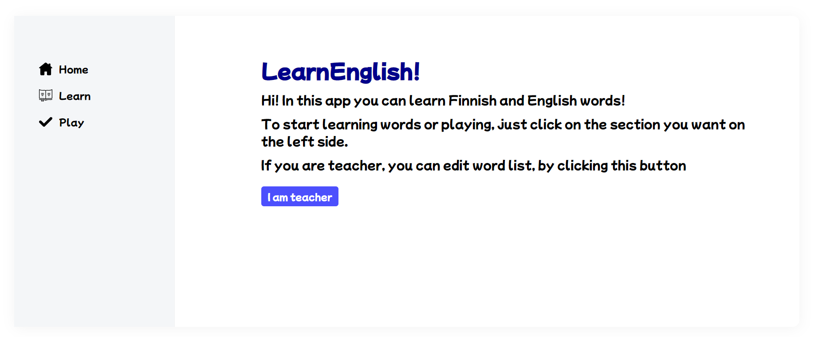
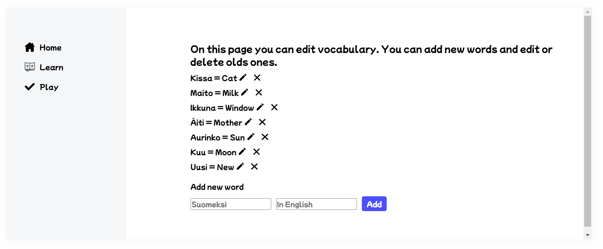
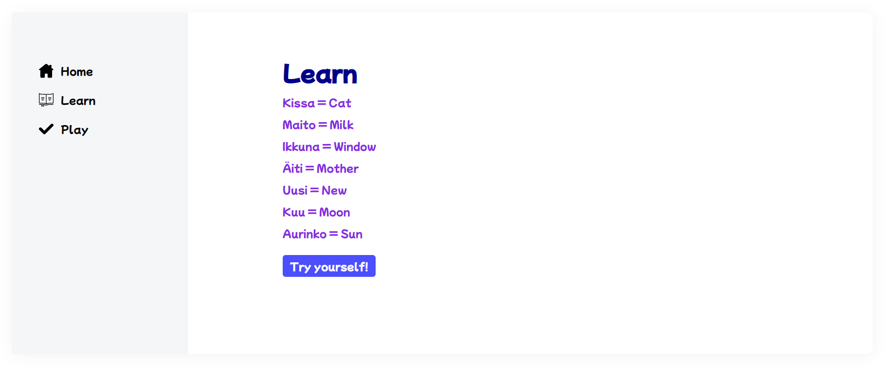
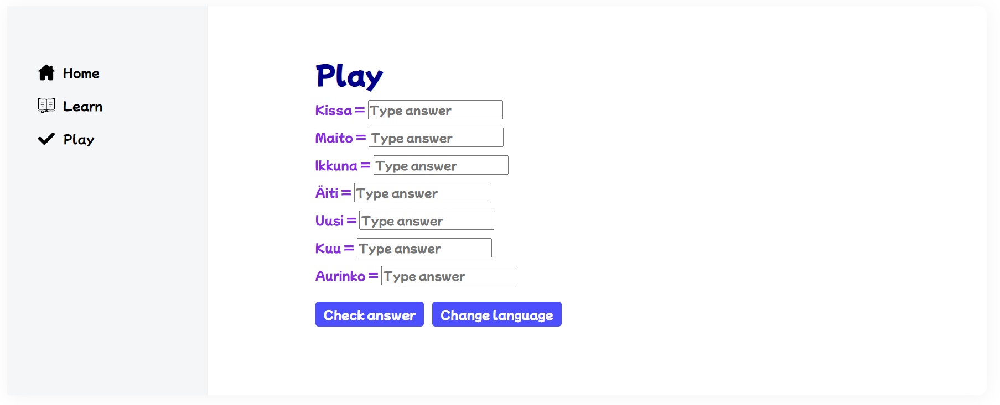
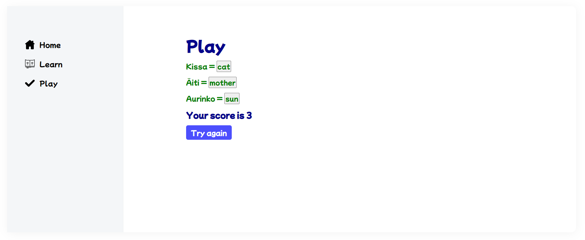

# LearnEnglish!

App: https://tolpa-learn-english.herokuapp.com/ 

The application is built with <b>React</b> on the frontend and <b>Node.js</b> with <b>Express.js</b> on the backend. 
<b>MySQL</b> database on TAMK server is used as storage. The app is hosted on the Heroku cloud platform.

LearnEnglish! allows you to learn English words and practice translation from Finnish to English and vice versa.  
The application has a minimalistic look so that even the child can easily understand it.

The main page has a short welcome and a button for the teacher (parent) to edit the word list.

By clicking on the button, the teacher (parent) goes to the editing page.

For the user (child) in the application there are two modes: learning words and playing.  
The learning mode opens the entire list of Finnish words with English translation:

When the child has learned the words, he can switch to play mode. 
In this mode the user has to write the translation of the words. Finnish words are given by default and need to be translated into English. It is possible to change the language, and then you will need to write a Finnish translation of English words.

After the user has entered the words, when he clicks on the check button, the score and the words that the user entered correctly appear. After that, he can try to play again.

Application author: Artem Tolpa
